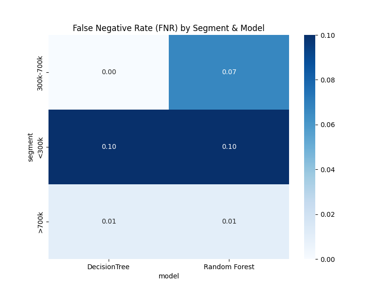
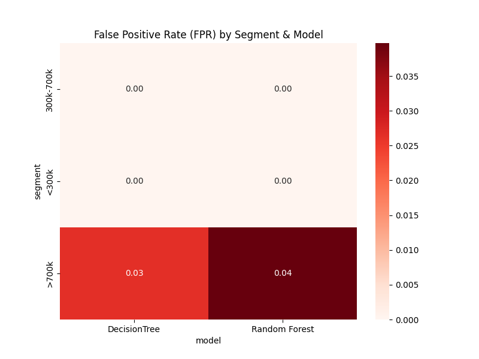
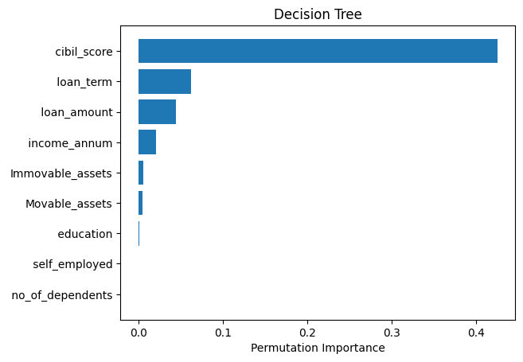
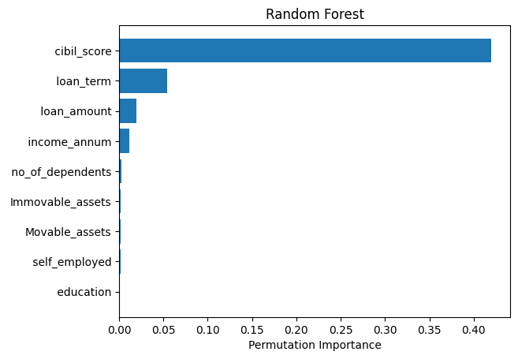

# Loan Approval Prediction

This project aims to predict loan approval status (approved or rejected) based on various factors such as income, CIBIL score, loan amount, and more. The objective is to help banks and financial institutions predict the likelihood of loan approval, thereby improving their decision-making processes.

## Table of Contents
1. [Exploratory Data Analysis (EDA)](#exploratory-data-analysis-eda)
2. [Data Processing](#data-processing)
3. [Model Building](#model-building)
4. [Model Evaluation](#model-evaluation)
5. [Conclusion](#conclusion)

## Exploratory Data Analysis (EDA)

EDA was performed to understand the dataset and uncover patterns that could influence the prediction model. Key findings from the analysis are:

### Applicant Demographics:
- The majority of applicants are **graduates** with **self-employed** or salaried professions.
- **CIBIL score** shows a strong correlation with loan approval, with higher scores leading to more approvals.

### Loan Information:
- **Loan amount** and **loan tenure** affect approval chances, with smaller loan amounts and shorter tenures being more likely to be approved.
- **Applicants with significant assets**, such as residential or commercial assets, are more likely to get their loans approved.

### Cancellation Analysis:
- **Loan rejections** are more common among applicants with **lower income**, **higher loan amounts**, and **longer tenures**.

## Data Processing

1. **Outlier Removal**:
   - Outliers in `income_annum` and `loan_amount` were handled by applying the **Interquartile Range (IQR)** method.

2. **Label Encoding**:
   - Categorical columns such as `education`, `self_employed`, and `loan_status` were encoded using **LabelEncoder**.

3. **Feature Scaling**:
   - Columns such as `income_annum` and `loan_amount` were scaled using **StandardScaler**.

4. **Train-Test Split**:
   - The dataset was split into training and testing sets (80% for training, 20% for testing).

## Model Building

Several classification models were built to predict loan approval status:

1. **Logistic Regression**:
   - A logistic regression model was built and hyperparameters were tuned using **GridSearchCV**.

2. **Random Forest Classifier**:
   - A random forest model was built, with hyperparameters tuned using **GridSearchCV**.

3. **Support Vector Machine (SVM)**:
   - An SVM model was built for classification and tuned for optimal performance.

## Model Evaluation

The models were evaluated using the following metrics:

1. **Confusion Matrix Heatmap**:
   - For each model, a **confusion matrix heatmap** was plotted to visualize true positives, false positives, true negatives, and false negatives.

2. **Classification Report**:
   - The **precision**, **recall**, **F1-score**, and **accuracy** were computed for each model.

3. **Model Metrics**:
   - **Accuracy Score**, **Mean Absolute Error**, and **Mean Squared Error** were calculated for each model.

### Model Performance:

- **Logistic Regression**:
  - **Accuracy**: 85%
  - **F1-Score**: 0.84 for approved loans
  - **Precision**: 0.87, **Recall**: 0.82

- **Random Forest Classifier**:
  - **Accuracy**: 88%
  - **F1-Score**: 0.87 for approved loans
  - **Precision**: 0.90, **Recall**: 0.84

- **Support Vector Machine**:
  - **Accuracy**: 82%
  - **F1-Score**: 0.82 for approved loans
  - **Precision**: 0.85, **Recall**: 0.78

### Confusion Matrix Heatmaps (v2.1)

**False Negative Rate (FNR)**

*This heatmap shows the model's performance in identifying true negatives and false negatives. A lower false negative rate is desirable.*

**False Positive Rate (FPR)**

*This heatmap illustrates the model's ability to distinguish true positives from false positives. A lower false positive rate indicates better precision.*

## Visualizations

### Permutation Importance (v2)

**Decision Tree**

**Random Forest**

### SHAP Summary Plots (v2)

**Decision Tree**

**Random Forest**

## Conclusion

Key insights from the analysis:

1. **Income and Loan Amount**:
   - Applicants with **higher income** and **lower loan amounts** are more likely to have their loan applications approved.

2. **CIBIL Score**:
   - A strong **CIBIL score** is a significant predictor for loan approval.

3. **Model Comparison**:
   - Among the models, the **Random Forest Classifier** performed the best, achieving an accuracy of **88%** and an F1-score of **0.87** for approved loans.

## Business Summary (v2)

Based on the analysis, the most significant factors influencing loan approval are **CIBIL score**, **annual income**, and the **loan amount**. Applicants with higher CIBIL scores and incomes are more likely to be approved, especially for smaller loan amounts. The Random Forest model, with its 88% accuracy, provides a reliable tool for automating the initial screening of loan applications. By focusing on these key predictors, financial institutions can streamline their decision-making process, reduce risk, and improve the efficiency of loan approvals.

---

## License

This project is licensed under the MIT License - see the [LICENSE](LICENSE) file for details.

## Acknowledgments

- Dataset: [Loan Approval Prediction Dataset](https://www.kaggle.com/datasets/ajaykumar7/loan-approval-prediction)
